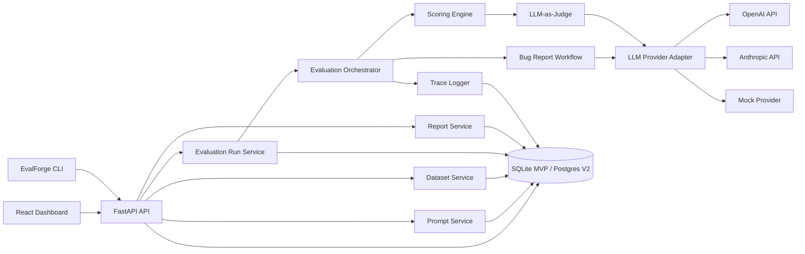
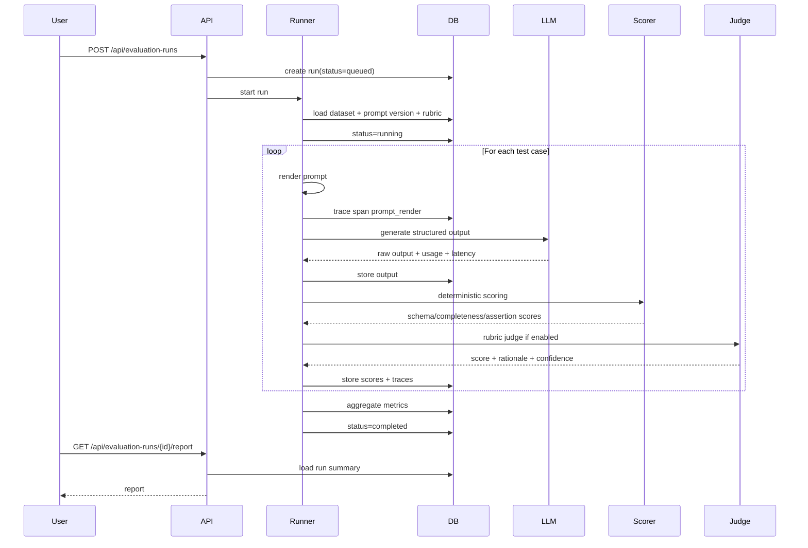

# EvalForge Development Plan

Last updated: 2026-05-23

EvalForge is a portfolio-grade AI QA and LLM evaluation platform. The goal is to show practical platform engineering skill: evaluation infrastructure, prompt and model regression testing, structured AI workflows, traceability, cost and latency metrics, and production-minded QA automation.

This plan replaces the original UI-generation idea from the broader 16-week tracker with an LLM evaluation and AI QA platform. The learning arc remains useful: FastAPI, Docker, CI, auth, observability, Prometheus/Grafana, Kubernetes, failure taxonomy, demo polish, and resume positioning.

## 1. Product Definition

### Problem Statement

Teams building LLM features lack reliable feedback loops. A prompt update, model change, or workflow tweak can improve a few examples while silently breaking others. Traditional unit tests are too rigid for many generative outputs, while ad hoc manual review does not scale.

EvalForge solves this by giving engineers a small internal platform for:

- Running LLM workflows against golden datasets.
- Comparing prompt and model versions.
- Scoring outputs with deterministic checks, rubrics, LLM-as-judge, and human review.
- Tracking cost, latency, schema validity, failure categories, and regressions over time.
- Turning messy bug reports into structured QA artifacts and regression test ideas.

### Target Users

- AI tooling engineers who maintain internal LLM workflows.
- QA platform engineers responsible for regression safety.
- Developer productivity teams building AI-assisted engineering tools.
- Product engineers shipping AI features who need confidence before prompt or model changes.
- QA leads who want structured triage and repeatable evaluation rather than manual spreadsheet review.

### Core Use Cases

1. Prompt regression testing
   - Run a dataset against prompt version `bug_triage:v1` and `bug_triage:v2`.
   - Compare pass rate, rubric score, schema validity, latency, and cost.
   - Flag cases that regressed.

2. Bug report intelligence
   - Input raw bug reports from users, QA, support, or issue trackers.
   - Produce structured summaries, reproduction steps, severity suggestions, suspected component, missing information, and regression test ideas.
   - Evaluate those outputs against golden expectations and rubrics.

3. Evaluation reporting
   - Show run summary, per-case results, judge rationales, failure categories, and trend metrics.
   - Export a Markdown or JSON report suitable for a pull request.

4. Human review loop
   - Allow a reviewer to mark judge decisions as correct or incorrect.
   - Capture corrected labels and notes.
   - Promote reviewed failures into future golden datasets.

5. Workflow trace inspection
   - Show each workflow step: prompt render, model call, parser validation, scorer execution, judge call, and report aggregation.
   - Preserve raw inputs and outputs for debugging.

### Differentiation From Generic Chatbots

EvalForge is not a chat UI. It is a regression and quality platform.

- Chatbots optimize for one-off interaction. EvalForge optimizes for repeatable experiments.
- Chatbots hide internal execution. EvalForge stores prompts, model parameters, traces, scores, and artifacts.
- Chatbots produce answers. EvalForge produces quality signals, comparisons, and release gates.
- Chatbots are subjective. EvalForge makes pass/fail rules, rubrics, and review decisions explicit.
- Chatbots are hard to audit. EvalForge records dataset version, prompt version, model, token usage, latency, cost, and judge rationale.

### Modern Platform Positioning

The project should reflect current LLM engineering patterns:

- Offline evals on curated datasets before changes ship.
- CI/CD regression gates for prompt and model changes.
- Prompt and model versioning as deployable artifacts.
- Mixed scoring: deterministic checks plus LLM-as-judge plus human review.
- Trace-first observability for LLM calls, tool calls, workflow steps, token usage, latency, and cost.
- Structured outputs validated with Pydantic and JSON Schema.
- Production-trace feedback loops where real failures become new golden test cases.
- Agent/workflow evaluation that scores intermediate behavior, not just final text.

## 2. MVP Scope

### MVP Principle

Build the smallest serious internal developer platform, not a toy chatbot. The MVP should demonstrate a complete evaluation loop end to end:

Dataset -> Prompt version -> Workflow execution -> Structured output -> Scoring -> Regression comparison -> Report -> Dashboard.

### MVP: 4-8 Week Version

The MVP should focus on one workflow: bug report intelligence.

#### MVP Features

- FastAPI backend with clean domain services.
- SQLite database with SQLAlchemy models and migrations.
- Pydantic schemas for API requests, structured LLM outputs, and scoring results.
- Prompt templates with explicit versions.
- Golden bug report dataset stored as JSONL and imported into the DB.
- Evaluation runner that executes test cases against a selected prompt version and model.
- Provider abstraction with:
  - Mock provider for tests and demo determinism.
  - OpenAI provider for real structured output calls.
  - Anthropic provider can be V2 unless time permits.
- Bug report workflow that returns structured JSON:
  - summary
  - reproduction_steps
  - expected_behavior
  - actual_behavior
  - suspected_component
  - severity
  - confidence
  - missing_information
  - regression_test_ideas
- Scoring engine:
  - JSON schema validity
  - required-field completeness
  - severity match or acceptable severity range
  - component match or partial match
  - rubric-based judge score
  - aggregate pass/fail
- Run comparison:
  - candidate run vs baseline run
  - per-case score delta
  - pass-to-fail regressions
  - cost and latency changes
- Simple React dashboard:
  - runs list
  - run detail
  - failed cases
  - output and judge rationale inspection
  - compare two runs
- Report export:
  - JSON for automation
  - Markdown for README/demo/PR comments
- pytest coverage for core services.
- Dockerfile and docker-compose for local run.
- GitHub Actions running lint, tests, and one mock evaluation.

#### MVP Non-Goals

- Multi-tenant SaaS.
- Full auth system.
- Kubernetes.
- Long-running distributed workers.
- Complex agent graphs.
- Vector database.
- Real production telemetry backend.
- Payment, billing, or organization management.
- Full LangGraph integration.
- Supporting every LLM provider.

### V2 Scope

V2 should add platform depth after the MVP loop is working.

- PostgreSQL support and stricter migrations.
- Background job runner with queue semantics.
- Anthropic provider.
- Human review UI.
- Failure taxonomy and reviewer labels.
- OpenTelemetry spans for each evaluation step.
- Prometheus metrics endpoint.
- Grafana dashboard with screenshots.
- API key auth.
- Dataset import/export from JSONL and CSV.
- CI mode that exits non-zero on regression thresholds.
- Pull request report artifact.
- Rerun failed cases only.
- Prompt diff view.
- Configurable scoring profiles.

### Future Roadmap

- LangGraph or custom DAG workflow execution.
- Agent/tool evaluation with intermediate-step scoring.
- Production trace ingestion.
- Dataset curation from real failures.
- Kubernetes manifests and local kind/minikube deployment.
- Role-based access control.
- External integrations:
  - GitHub Issues
  - Jira
  - Slack
  - Langfuse export/import
  - OpenTelemetry collector
- Advanced judge reliability:
  - multi-judge ensembles
  - calibration sets
  - judge disagreement tracking
  - repeated sampling for flaky cases
- Evaluation marketplace examples:
  - bug triage
  - release note generation
  - support ticket routing
  - code review comment classification
  - test case generation

## 3. System Architecture

### High-Level Architecture



### Backend Components

#### API Layer

- FastAPI routes.
- Request and response schemas.
- API error mapping.
- Pagination and filtering.
- Dependency injection for DB sessions and services.

#### Domain Services

- `PromptService`
  - Create prompt families.
  - Create immutable prompt versions.
  - Render templates with test-case variables.
  - Store output schema and model defaults.

- `DatasetService`
  - Create datasets.
  - Import JSONL test cases.
  - Validate test-case structure.
  - Activate/deactivate cases.

- `EvaluationRunService`
  - Create run records.
  - Manage run status lifecycle.
  - Start execution.
  - Aggregate final metrics.

- `WorkflowService`
  - Executes task-specific workflows.
  - MVP workflow: bug report intelligence.
  - Later: registry for multiple workflows.

- `ScoringService`
  - Runs deterministic scorers.
  - Runs LLM judge scorers.
  - Applies pass/fail thresholds.
  - Stores score details.

- `ComparisonService`
  - Compares candidate and baseline runs.
  - Identifies regressions, improvements, and unchanged cases.
  - Summarizes deltas.

- `ReportService`
  - Builds run reports.
  - Builds comparison reports.
  - Exports Markdown and JSON.

- `TraceService`
  - Creates spans for workflow steps.
  - Stores inputs, outputs, timing, status, and errors.
  - V2 maps internal spans to OpenTelemetry spans.

#### Provider Adapters

Define a provider interface:

```python
class LLMProvider(Protocol):
    async def generate(self, request: LLMRequest) -> LLMResponse: ...
```

`LLMRequest` should include:

- provider
- model
- system prompt
- user prompt
- temperature
- max tokens
- response schema
- metadata

`LLMResponse` should include:

- raw text
- parsed JSON if available
- provider response id
- finish reason
- token usage
- estimated cost
- latency
- model name returned by provider
- refusal or safety status when available
- error details

Adapters:

- `MockProvider`: deterministic fixtures for tests and demos.
- `OpenAIProvider`: structured outputs with JSON Schema or SDK-native Pydantic parsing where available.
- `AnthropicProvider`: V2, using tool-style schemas or explicit JSON validation depending on model/API capabilities.

### Frontend Components

Use React with a practical internal-tool design.

- App shell
  - left navigation
  - compact header
  - environment/status indicator

- Pages
  - Dashboard overview
  - Evaluation runs
  - Run detail
  - Run comparison
  - Datasets
  - Prompt versions
  - Human review queue
  - Settings/provider config

- Components
  - `MetricCard`
  - `RunStatusBadge`
  - `ScoreBreakdownTable`
  - `CaseResultTable`
  - `OutputInspector`
  - `TraceTimeline`
  - `PromptVersionSelector`
  - `DatasetSelector`
  - `RegressionDiffPanel`
  - `FailureCategoryFilter`

- Libraries
  - React
  - TypeScript
  - TanStack Query
  - React Router
  - Recharts or Tremor-style simple charts
  - shadcn/ui or a restrained custom component set

### Evaluation Pipeline Design



### Execution Flow

1. User creates or selects:
   - dataset
   - prompt version
   - model/provider
   - scoring profile
   - optional baseline run

2. API creates an `evaluation_runs` row with `queued`.

3. Runner loads active test cases.

4. For each test case:
   - Validate input JSON.
   - Render prompt template.
   - Start trace span `workflow.case`.
   - Call provider.
   - Parse/validate structured output.
   - Store raw and parsed output.
   - Run deterministic scorers.
   - Run LLM judge scorer if configured.
   - Store score records.
   - Close trace span.

5. After all cases:
   - Aggregate metrics.
   - Detect regressions against baseline.
   - Store run metrics.
   - Mark run complete or failed.

6. UI polls run status and renders details.

### Trace and Logging Architecture

MVP uses database-backed traces plus structured application logs. V2 maps the same span model to OpenTelemetry.

Trace span types:

- `run`
- `case`
- `prompt_render`
- `llm_call`
- `parse`
- `deterministic_scorer`
- `llm_judge`
- `aggregate`
- `report_export`

Each span stores:

- run id
- output id when case-scoped
- parent span id
- span name
- span type
- start/end timestamps
- duration
- status
- input summary
- output summary
- metadata
- error type/message

Structured logs should include:

- `request_id`
- `run_id`
- `test_case_id`
- `prompt_version_id`
- `provider`
- `model`
- `span_id`
- `event`
- `duration_ms`
- `status`

V2 OpenTelemetry mapping:

- `evaluation.run` span
- `evaluation.case` child spans
- `llm.call` spans with model, token usage, and cost attributes
- `scorer.run` spans
- Prometheus metrics derived from run metrics and app instrumentation

## 4. Database Design

Use SQLAlchemy 2.x and Alembic. SQLite is enough for MVP if the schema avoids SQLite-only assumptions. Postgres should work with minimal changes in V2.

### Core Tables

#### `prompt_templates`

| Column | Type | Notes |
| --- | --- | --- |
| id | uuid/string | primary key |
| slug | string unique | example: `bug-triage` |
| name | string | display name |
| task_type | string | example: `bug_report_intelligence` |
| description | text | optional |
| created_at | datetime |  |
| updated_at | datetime |  |

#### `prompt_versions`

| Column | Type | Notes |
| --- | --- | --- |
| id | uuid/string | primary key |
| prompt_template_id | fk | references `prompt_templates` |
| version_label | string | example: `v1`, `v2` |
| status | enum | `draft`, `active`, `archived` |
| system_message | text | system/developer instruction |
| template_text | text | user prompt template |
| variables_schema_json | json | required input variables |
| output_schema_json | json | expected structured output |
| model_defaults_json | json | default model/provider params |
| changelog | text | why version changed |
| git_commit_sha | string | optional |
| created_by | string | optional |
| created_at | datetime |  |

Rule: prompt versions should be immutable after creation. Create a new version rather than editing historical versions.

#### `datasets`

| Column | Type | Notes |
| --- | --- | --- |
| id | uuid/string | primary key |
| slug | string unique | example: `bug-reports-golden-v1` |
| name | string | display name |
| task_type | string | must match workflow |
| version | string | dataset version |
| description | text |  |
| source_type | string | `manual`, `jsonl`, `production_trace`, `synthetic` |
| tags_json | json | portfolio labels, components |
| created_at | datetime |  |
| updated_at | datetime |  |

#### `test_cases`

| Column | Type | Notes |
| --- | --- | --- |
| id | uuid/string | primary key |
| dataset_id | fk | references `datasets` |
| external_id | string | stable readable id |
| input_json | json | raw bug report and context |
| expected_json | json | expected fields or ranges |
| assertions_json | json | deterministic checks |
| metadata_json | json | component, severity, source, tags |
| active | bool | allow excluding cases |
| created_at | datetime |  |
| updated_at | datetime |  |

Example `input_json`:

```json
{
  "raw_bug_report": "Checkout fails with a 500 after applying coupon SAVE10...",
  "product_area": "checkout",
  "platform": "web"
}
```

Example `expected_json`:

```json
{
  "severity": "high",
  "suspected_component": "checkout",
  "must_include_repro_step_keywords": ["apply coupon", "checkout"],
  "must_include_test_idea_keywords": ["coupon", "500"]
}
```

#### `rubrics`

| Column | Type | Notes |
| --- | --- | --- |
| id | uuid/string | primary key |
| slug | string unique | example: `bug-triage-v1` |
| name | string | display name |
| task_type | string | workflow type |
| description | text |  |
| dimensions_json | json | weighted dimensions |
| created_at | datetime |  |

Example dimensions:

```json
[
  {"name": "summary_quality", "weight": 0.2, "threshold": 0.7},
  {"name": "reproduction_steps", "weight": 0.25, "threshold": 0.7},
  {"name": "severity_reasoning", "weight": 0.2, "threshold": 0.65},
  {"name": "test_ideas", "weight": 0.2, "threshold": 0.7},
  {"name": "no_hallucinated_facts", "weight": 0.15, "threshold": 0.8}
]
```

#### `evaluation_runs`

| Column | Type | Notes |
| --- | --- | --- |
| id | uuid/string | primary key |
| run_name | string | optional display name |
| status | enum | `queued`, `running`, `completed`, `failed`, `canceled` |
| task_type | string | workflow type |
| dataset_id | fk | dataset |
| prompt_version_id | fk | prompt version |
| rubric_id | fk nullable | scoring rubric |
| baseline_run_id | fk nullable | comparison baseline |
| model_provider | string | `openai`, `anthropic`, `mock` |
| model_name | string | provider model id |
| model_parameters_json | json | temperature, max tokens |
| scoring_profile_json | json | enabled scorers and thresholds |
| total_cases | int | cached |
| passed_cases | int | cached |
| failed_cases | int | cached |
| started_at | datetime | nullable |
| completed_at | datetime | nullable |
| error_message | text | nullable |
| created_at | datetime |  |

#### `eval_outputs`

| Column | Type | Notes |
| --- | --- | --- |
| id | uuid/string | primary key |
| run_id | fk | references `evaluation_runs` |
| test_case_id | fk | references `test_cases` |
| prompt_rendered_hash | string | avoid storing huge duplicate prompts in metrics |
| rendered_prompt_text | text | useful for debug in MVP |
| request_json | json | provider request summary |
| raw_output_text | text | raw model output |
| parsed_output_json | json nullable | structured result |
| schema_valid | bool | parser result |
| provider_response_id | string | nullable |
| finish_reason | string | nullable |
| error_type | string nullable | provider/parser error |
| error_message | text nullable |  |
| latency_ms | int |  |
| input_tokens | int | nullable |
| output_tokens | int | nullable |
| total_tokens | int | nullable |
| cost_usd | numeric | nullable |
| created_at | datetime |  |

#### `scoring_results`

| Column | Type | Notes |
| --- | --- | --- |
| id | uuid/string | primary key |
| run_id | fk | run |
| output_id | fk | output |
| scorer_type | string | `deterministic`, `llm_judge`, `human`, `aggregate` |
| scorer_name | string | example: `schema_validity` |
| dimension | string | example: `reproduction_steps` |
| score | numeric | raw score |
| normalized_score | numeric | 0-1 |
| passed | bool | threshold result |
| threshold | numeric | nullable |
| confidence | numeric | 0-1 |
| rationale | text | judge or scorer explanation |
| metadata_json | json | scorer-specific details |
| created_at | datetime |  |

#### `traces`

| Column | Type | Notes |
| --- | --- | --- |
| id | uuid/string | primary key |
| run_id | fk | run |
| output_id | fk nullable | case output |
| span_id | string | unique |
| parent_span_id | string nullable | causal tree |
| name | string | span name |
| span_type | string | `llm_call`, `judge`, etc. |
| started_at | datetime |  |
| ended_at | datetime | nullable |
| duration_ms | int nullable |  |
| status | string | `ok`, `error` |
| input_json | json nullable | summarized input |
| output_json | json nullable | summarized output |
| metadata_json | json | provider/model/tokens |
| error_message | text nullable |  |

#### `run_metrics`

| Column | Type | Notes |
| --- | --- | --- |
| id | uuid/string | primary key |
| run_id | fk | run |
| metric_name | string | example: `pass_rate` |
| metric_value | numeric |  |
| unit | string | `%`, `ms`, `usd`, `count` |
| dimensions_json | json | optional grouping |
| created_at | datetime |  |

#### `run_comparisons`

| Column | Type | Notes |
| --- | --- | --- |
| id | uuid/string | primary key |
| baseline_run_id | fk | baseline |
| candidate_run_id | fk | candidate |
| summary_json | json | aggregate diff |
| created_at | datetime |  |

#### `human_reviews`

| Column | Type | Notes |
| --- | --- | --- |
| id | uuid/string | primary key |
| run_id | fk | run |
| output_id | fk | output |
| reviewer | string | local username/email |
| label | string | `accepted`, `incorrect`, `needs_review` |
| corrected_output_json | json nullable | reviewer correction |
| score_override | numeric nullable | optional |
| notes | text | rationale |
| created_at | datetime |  |

## 5. API Design

Use `/api` prefix and JSON responses. IDs can be UUID strings.

### Health

```http
GET /health
```

Response:

```json
{"status": "ok", "service": "evalforge"}
```

### Prompt APIs

```http
GET /api/prompts
POST /api/prompts
GET /api/prompts/{prompt_id}
GET /api/prompts/{prompt_id}/versions
POST /api/prompts/{prompt_id}/versions
GET /api/prompt-versions/{version_id}
POST /api/prompt-versions/{version_id}/activate
```

Create prompt:

```json
{
  "slug": "bug-triage",
  "name": "Bug Triage",
  "task_type": "bug_report_intelligence",
  "description": "Converts raw bug reports into structured QA artifacts."
}
```

Create version:

```json
{
  "version_label": "v1",
  "system_message": "You are a senior QA engineer...",
  "template_text": "Analyze this bug report: {{ raw_bug_report }}",
  "variables_schema": {
    "type": "object",
    "required": ["raw_bug_report"],
    "properties": {
      "raw_bug_report": {"type": "string"}
    }
  },
  "output_schema": {
    "type": "object",
    "required": ["summary", "severity", "reproduction_steps"],
    "properties": {
      "summary": {"type": "string"},
      "severity": {"type": "string", "enum": ["low", "medium", "high", "critical"]},
      "reproduction_steps": {"type": "array", "items": {"type": "string"}}
    }
  },
  "model_defaults": {
    "provider": "openai",
    "model": "gpt-4.1-mini",
    "temperature": 0
  },
  "changelog": "Initial MVP prompt."
}
```

### Dataset APIs

```http
GET /api/datasets
POST /api/datasets
GET /api/datasets/{dataset_id}
GET /api/datasets/{dataset_id}/test-cases
POST /api/datasets/{dataset_id}/test-cases
POST /api/datasets/{dataset_id}/import-jsonl
GET /api/datasets/{dataset_id}/export-jsonl
PATCH /api/test-cases/{test_case_id}
DELETE /api/test-cases/{test_case_id}
```

Create dataset:

```json
{
  "slug": "bug-reports-golden-v1",
  "name": "Bug Reports Golden Set v1",
  "task_type": "bug_report_intelligence",
  "version": "v1",
  "source_type": "manual",
  "tags": ["mvp", "qa", "bug-triage"]
}
```

Create test case:

```json
{
  "external_id": "BUG-001",
  "input": {
    "raw_bug_report": "Checkout returns a 500 after applying coupon SAVE10..."
  },
  "expected": {
    "severity": "high",
    "suspected_component": "checkout"
  },
  "assertions": [
    {"type": "json_schema"},
    {"type": "enum_match", "field": "severity", "value": "high"},
    {"type": "contains_any", "field": "regression_test_ideas", "keywords": ["coupon", "checkout"]}
  ],
  "metadata": {
    "component": "checkout",
    "source": "synthetic"
  }
}
```

### Evaluation Run APIs

```http
GET /api/evaluation-runs
POST /api/evaluation-runs
GET /api/evaluation-runs/{run_id}
POST /api/evaluation-runs/{run_id}/cancel
POST /api/evaluation-runs/{run_id}/rerun-failures
GET /api/evaluation-runs/{run_id}/outputs
GET /api/evaluation-runs/{run_id}/outputs/{output_id}
GET /api/evaluation-runs/{run_id}/metrics
GET /api/evaluation-runs/{run_id}/traces
```

Create run:

```json
{
  "run_name": "bug-triage-v2-openai",
  "dataset_id": "dataset_123",
  "prompt_version_id": "prompt_version_456",
  "rubric_id": "rubric_789",
  "baseline_run_id": "run_baseline",
  "model_provider": "openai",
  "model_name": "gpt-4.1-mini",
  "model_parameters": {
    "temperature": 0,
    "max_output_tokens": 1200
  },
  "scoring_profile": {
    "deterministic": true,
    "llm_judge": true,
    "minimum_case_score": 0.75,
    "minimum_run_pass_rate": 0.9,
    "maximum_cost_usd": 1.0,
    "maximum_p95_latency_ms": 10000
  }
}
```

Response:

```json
{
  "id": "run_123",
  "status": "queued",
  "created_at": "2026-05-23T09:00:00Z"
}
```

### Comparison APIs

```http
POST /api/comparisons
GET /api/comparisons/{comparison_id}
GET /api/evaluation-runs/{candidate_run_id}/compare?baseline_run_id={baseline_run_id}
```

Create comparison:

```json
{
  "baseline_run_id": "run_v1",
  "candidate_run_id": "run_v2",
  "regression_thresholds": {
    "min_pass_rate_delta": -0.03,
    "min_score_delta": -0.05,
    "max_cost_increase_pct": 20,
    "max_latency_increase_pct": 25
  }
}
```

Response summary:

```json
{
  "baseline_run_id": "run_v1",
  "candidate_run_id": "run_v2",
  "status": "regressed",
  "summary": {
    "pass_rate_delta": -0.08,
    "mean_score_delta": -0.04,
    "hard_regressions": 3,
    "improvements": 5,
    "cost_delta_pct": 11.2,
    "latency_delta_pct": 6.4
  }
}
```

### Report APIs

```http
GET /api/evaluation-runs/{run_id}/report
GET /api/evaluation-runs/{run_id}/report.md
GET /api/comparisons/{comparison_id}/report
GET /api/comparisons/{comparison_id}/report.md
```

Report should include:

- run metadata
- dataset and prompt version
- model/provider
- pass/fail summary
- score breakdown
- failed cases
- regression cases
- cost and latency metrics
- judge confidence distribution
- links to traces and outputs

### Human Review APIs

```http
GET /api/review-queue
POST /api/outputs/{output_id}/reviews
GET /api/outputs/{output_id}/reviews
PATCH /api/reviews/{review_id}
```

Submit review:

```json
{
  "reviewer": "local-user",
  "label": "incorrect",
  "score_override": 0.4,
  "corrected_output": {
    "severity": "critical",
    "suspected_component": "checkout"
  },
  "notes": "Judge underweighted checkout outage impact."
}
```

### Ad Hoc Workflow API

Useful for demo and manual testing:

```http
POST /api/workflows/bug-report-intelligence/run
```

Request:

```json
{
  "raw_bug_report": "Mobile app crashes when opening order history...",
  "prompt_version_id": "prompt_version_456",
  "model_provider": "mock",
  "model_name": "mock-bug-triage"
}
```

## 6. Evaluation Framework

### Scoring Architecture

Use a scorer interface:

```python
class Scorer(Protocol):
    name: str
    scorer_type: str

    async def score(self, context: ScoringContext) -> ScoreResult: ...
```

`ScoringContext` includes:

- test case input
- expected output
- actual parsed output
- raw output
- prompt version
- model metadata
- trace metadata

`ScoreResult` includes:

- scorer name
- dimension
- raw score
- normalized score
- threshold
- passed
- confidence
- rationale
- metadata

### Scorer Types

#### Deterministic Scorers

Use these wherever possible because they are cheap and stable.

- `SchemaValidityScorer`
  - Passes if output validates against the prompt version output schema.

- `RequiredFieldsScorer`
  - Checks non-empty fields such as summary, severity, component, steps.

- `EnumMatchScorer`
  - Checks expected severity or acceptable severity set.

- `KeywordCoverageScorer`
  - Checks that reproduction steps or test ideas include important facts.

- `NoForbiddenClaimsScorer`
  - Flags hallucinated facts that contradict input or expected constraints.

- `LatencyBudgetScorer`
  - Fails if case latency exceeds threshold.

- `CostBudgetScorer`
  - Fails if cost exceeds threshold.

#### LLM-as-Judge Scorers

Use for qualitative dimensions:

- Summary quality.
- Completeness of reproduction steps.
- Severity reasoning.
- Usefulness of regression test ideas.
- No hallucinated facts.
- Overall QA usefulness.

The judge should return structured JSON:

```json
{
  "scores": [
    {
      "dimension": "reproduction_steps",
      "score": 0.82,
      "passed": true,
      "confidence": 0.74,
      "rationale": "Steps are actionable and preserve the reported coupon behavior."
    }
  ],
  "overall_score": 0.79,
  "overall_passed": true,
  "risk_flags": ["missing_browser_version"]
}
```

Judge prompt rules:

- Include the original input, expected criteria, and actual output.
- Ask for evidence-grounded scoring only.
- Require the judge to cite which input facts support its decision.
- Penalize invented facts.
- Keep the output schema strict.
- Use a cheaper, stable judge model for MVP.
- Store the full judge request and response for auditability.

#### Human Review Scorer

Human review is not needed for every case in MVP, but the schema should support it.

Human review can:

- Override a judge score.
- Mark a model output as acceptable despite automated failure.
- Mark judge rationale as wrong.
- Add corrected expected output.
- Promote case to a curated dataset.

### Pass/Fail Logic

Case-level logic:

- Required deterministic checks must pass.
- Overall normalized score must be above `minimum_case_score`.
- If schema validation fails, the case fails regardless of judge score.
- Cost and latency budget failures can be configured as either blocking or warning.

Run-level logic:

- `pass_rate >= minimum_run_pass_rate`
- `mean_score >= minimum_mean_score`
- `schema_validity_rate >= minimum_schema_validity_rate`
- `hard_regression_count <= allowed_hard_regressions`
- `total_cost_usd <= maximum_cost_usd`
- `p95_latency_ms <= maximum_p95_latency_ms`

Recommended MVP defaults:

```json
{
  "minimum_case_score": 0.75,
  "minimum_run_pass_rate": 0.90,
  "minimum_schema_validity_rate": 1.0,
  "allowed_hard_regressions": 0,
  "max_mean_score_drop": 0.05,
  "max_pass_rate_drop": 0.03
}
```

### Rubric System

Rubrics should be data, not code. Store them as JSON/YAML in `evals/rubrics/` and import into the DB.

Example:

```yaml
slug: bug-triage-v1
task_type: bug_report_intelligence
dimensions:
  - name: summary_quality
    weight: 0.20
    threshold: 0.70
    description: Summary captures the user-visible problem without adding facts.
  - name: reproduction_steps
    weight: 0.25
    threshold: 0.70
    description: Steps are ordered, actionable, and grounded in the report.
  - name: severity_reasoning
    weight: 0.20
    threshold: 0.65
    description: Severity is appropriate for impact and scope.
  - name: regression_test_ideas
    weight: 0.20
    threshold: 0.70
    description: Test ideas are automatable and target the failure mode.
  - name: no_hallucinated_facts
    weight: 0.15
    threshold: 0.80
    description: Output does not invent devices, accounts, logs, or systems.
```

### Regression Detection

Compare candidate run to baseline run case-by-case using stable `test_case.external_id`.

Regression categories:

- Hard regression: baseline passed, candidate failed.
- Soft regression: candidate score dropped more than threshold.
- Schema regression: candidate output stopped validating.
- Cost regression: cost increased beyond configured percentage.
- Latency regression: p95 or case latency increased beyond configured percentage.
- Confidence regression: judge confidence dropped below threshold.
- Behavioral regression: severity/component/test idea changed from expected to unexpected.

Comparison output:

```json
{
  "status": "regressed",
  "hard_regressions": [
    {
      "test_case_id": "BUG-001",
      "baseline_score": 0.84,
      "candidate_score": 0.61,
      "reason": "Candidate omitted coupon application step."
    }
  ],
  "metric_deltas": {
    "pass_rate": -0.08,
    "mean_score": -0.04,
    "schema_validity_rate": 0,
    "total_cost_usd": 0.12,
    "p95_latency_ms": 650
  }
}
```

### Confidence Tracking

Confidence should be explicit because evals can be noisy.

Recommended confidence model:

- Deterministic scorer confidence: `1.0`.
- Parser confidence: `1.0` if schema-valid, `0.0` if invalid.
- LLM judge confidence: returned by judge but bounded and calibrated.
- Aggregate confidence: weighted average reduced by:
  - judge confidence below 0.6
  - output near pass/fail threshold
  - missing expected fields
  - known flaky case
  - provider error/retry

Flag cases as `needs_human_review` when:

- score is within 0.05 of threshold
- judge confidence below 0.6
- deterministic and judge results disagree
- candidate differs materially from baseline but still passes
- output has high severity or high business impact metadata

### Tradeoffs and Failure Cases

- LLM judges are biased and can be inconsistent.
  - Mitigation: use deterministic checks for objective claims, keep judge prompts strict, store rationales, sample human reviews.

- Golden data can become stale.
  - Mitigation: version datasets, track source, add reviewed production failures, archive obsolete cases.

- Structured outputs can validate while still being wrong.
  - Mitigation: schema validation is a gate, not the full score.

- Model providers change behavior.
  - Mitigation: store model name, provider response metadata, prompt version, parameters, and run timestamp.

- Regression thresholds can hide important failures.
  - Mitigation: case-level hard regressions should block even when aggregate score looks acceptable.

- Repeated LLM calls can be expensive.
  - Mitigation: mock provider for tests, run judge only when needed, support rerun failures, track cost per run.

- Test cases may overfit prompts.
  - Mitigation: maintain hidden or holdout cases and vary report style.

- Human review can drift.
  - Mitigation: use reviewer labels and compare human/judge agreement over time.

## 7. Repository Structure

Recommended monorepo:

```text
evalforge/
  README.md
  Makefile
  docker-compose.yml
  Dockerfile
  pyproject.toml
  .env.example
  .github/
    workflows/
      ci.yml

  backend/
    app/
      main.py
      api/
        deps.py
        errors.py
        routes/
          health.py
          prompts.py
          datasets.py
          evaluation_runs.py
          comparisons.py
          reports.py
          reviews.py
          workflows.py
      core/
        config.py
        logging.py
        ids.py
        time.py
      db/
        session.py
        base.py
        migrations/
      models/
        prompt.py
        dataset.py
        evaluation.py
        scoring.py
        trace.py
        review.py
      schemas/
        prompts.py
        datasets.py
        evaluation_runs.py
        scoring.py
        reports.py
        bug_report.py
      services/
        prompt_service.py
        dataset_service.py
        run_service.py
        comparison_service.py
        report_service.py
        trace_service.py
      evals/
        runner.py
        scoring/
          base.py
          deterministic.py
          judge.py
          aggregate.py
        rubrics.py
      providers/
        base.py
        mock.py
        openai_provider.py
        anthropic_provider.py
        cost.py
      workflows/
        registry.py
        bug_report_intelligence.py
      observability/
        traces.py
        metrics.py

    tests/
      conftest.py
      unit/
        test_prompt_rendering.py
        test_dataset_import.py
        test_scoring.py
        test_regression_detection.py
      integration/
        test_run_evaluation_mock.py
        test_reports_api.py

  frontend/
    package.json
    vite.config.ts
    src/
      main.tsx
      app/
        App.tsx
        routes.tsx
      api/
        client.ts
        evaluationRuns.ts
        prompts.ts
        datasets.ts
      components/
        MetricCard.tsx
        RunStatusBadge.tsx
        ScoreBreakdownTable.tsx
        TraceTimeline.tsx
        OutputInspector.tsx
      pages/
        DashboardPage.tsx
        RunsPage.tsx
        RunDetailPage.tsx
        CompareRunsPage.tsx
        DatasetsPage.tsx
        PromptsPage.tsx
        ReviewQueuePage.tsx
      styles/
        globals.css

  datasets/
    golden/
      bug_reports_v1.jsonl
    examples/
      bug_reports_demo.jsonl

  prompts/
    bug_report_intelligence/
      v1.md
      v2.md
      output_schema.json

  evals/
    rubrics/
      bug_triage_v1.yaml
    scoring_profiles/
      strict_ci.yaml
      exploratory.yaml

  docs/
    evalforge-development-plan.md
    architecture.md
    demo-script.md
    adr/
      0001-start-with-monolith.md
      0002-sqlite-first-postgres-compatible.md
      0003-schema-first-llm-outputs.md
    screenshots/
```

### CI/CD

MVP GitHub Actions:

- Install backend dependencies.
- Run formatting/lint.
- Run pytest with mock provider.
- Run a small mock evaluation command.
- Upload report artifact.

V2:

- Build Docker image.
- Run frontend tests/build.
- Run backend integration tests against Postgres service container.
- Fail PR if regression gate fails on golden dataset.
- Publish coverage and evaluation report summary.

## 8. Development Plan

### Phase 0: Product and Scaffold

Difficulty: Low

Deliverables:

- Repo skeleton.
- README v0.
- Architecture doc.
- ADR for monolith and SQLite-first approach.

Technical tasks:

1. Create backend and frontend folders.
2. Add `pyproject.toml`, pytest, Ruff or equivalent.
3. Add FastAPI app with `/health`.
4. Add config loading from `.env`.
5. Add initial docs and planning.

Recommended order:

1. Backend health endpoint.
2. Test setup.
3. Repo docs.
4. CI stub.

### Phase 1: Domain Model and Storage

Difficulty: Medium

Deliverables:

- SQLAlchemy models.
- Alembic migrations.
- SQLite database.
- Seed commands for prompts, rubrics, and datasets.

Technical tasks:

1. Implement prompt tables.
2. Implement dataset/test case tables.
3. Implement run/output/score/trace tables.
4. Add repositories or service-level DB access.
5. Add import JSONL command.
6. Add unit tests for import and validation.

Recommended order:

1. Prompt and dataset models.
2. Evaluation run models.
3. Import seed data.
4. Tests.

### Phase 2: Prompt and Dataset APIs

Difficulty: Medium

Deliverables:

- CRUD APIs for prompts and datasets.
- Prompt rendering.
- Bug report output schema.
- Golden dataset v1.

Technical tasks:

1. Create prompt routes.
2. Create dataset routes.
3. Implement immutable prompt versions.
4. Implement Jinja2 or simple template rendering.
5. Validate template variables against schema.
6. Add tests for routes and rendering.

Recommended order:

1. Schemas.
2. Services.
3. Routes.
4. Tests.

### Phase 3: LLM Provider Abstraction and Workflow

Difficulty: Medium-High

Deliverables:

- Mock provider.
- OpenAI provider.
- Bug report intelligence workflow.
- Structured output parsing and validation.

Technical tasks:

1. Define `LLMProvider`, `LLMRequest`, `LLMResponse`.
2. Implement deterministic mock provider.
3. Implement provider registry.
4. Implement OpenAI structured-output adapter.
5. Implement Pydantic model for bug triage output.
6. Add workflow service.
7. Add integration test with mock provider.

Recommended order:

1. Mock provider and workflow.
2. Parser/schema validation.
3. OpenAI provider.
4. Tests.

### Phase 4: Evaluation Runner and Scoring

Difficulty: High

Deliverables:

- End-to-end evaluation run.
- Deterministic scorers.
- LLM judge scorer.
- Aggregate run metrics.

Technical tasks:

1. Implement run status lifecycle.
2. Build runner loop over test cases.
3. Store outputs and traces.
4. Implement deterministic scorers.
5. Implement rubric loader.
6. Implement LLM judge prompt and parser.
7. Aggregate pass rate, mean score, cost, latency, schema validity.
8. Add tests for scoring and run execution.

Recommended order:

1. Runner with mock provider.
2. Deterministic scoring.
3. Aggregates.
4. Judge scoring.
5. Trace storage.

### Phase 5: Reports and Regression Comparison

Difficulty: Medium-High

Deliverables:

- Run report endpoint.
- Markdown export.
- Baseline vs candidate comparison.
- Regression categories.

Technical tasks:

1. Implement report service.
2. Implement comparison service.
3. Add regression thresholds.
4. Add run comparison API.
5. Add report API.
6. Add tests for hard and soft regressions.

Recommended order:

1. Metrics summary.
2. Per-case diff.
3. Regression classification.
4. Markdown export.

### Phase 6: Dashboard MVP

Difficulty: Medium

Deliverables:

- React app.
- Runs list.
- Run detail.
- Compare runs.
- Prompt and dataset browser.

Technical tasks:

1. Create Vite React app.
2. Add API client.
3. Build app shell.
4. Build run list and detail pages.
5. Build output inspector and score table.
6. Build comparison page.
7. Add basic charts.

Recommended order:

1. Run list.
2. Run detail.
3. Failure inspector.
4. Compare page.
5. Prompt/dataset pages.

### Phase 7: DevEx, Docker, and CI

Difficulty: Medium

Deliverables:

- Dockerfile.
- docker-compose.
- GitHub Actions CI.
- Makefile commands.
- README run instructions.

Technical tasks:

1. Add `make test`, `make dev`, `make eval-demo`.
2. Dockerize backend.
3. Add compose service for backend and optional Postgres.
4. Add CI workflow.
5. Run mock eval in CI.
6. Export report artifact.

Recommended order:

1. Makefile.
2. CI tests.
3. Docker.
4. Demo eval command.

### Phase 8: Portfolio Polish

Difficulty: Medium

Deliverables:

- Polished README.
- Demo script.
- Architecture diagram screenshots.
- Dashboard screenshots.
- Resume bullets.
- Short demo video or GIF.

Technical tasks:

1. Create realistic demo dataset.
2. Create prompt v1 and intentionally improved v2.
3. Show a regression and a fix.
4. Capture dashboard screenshots.
5. Write architecture docs.
6. Add tradeoff docs and ADRs.

Recommended order:

1. Demo scenario.
2. Screenshots.
3. README.
4. Resume bullets.

### Extended 16-Week Platform Track

| Weeks | Focus | Outcome |
| --- | --- | --- |
| 1-2 | Scaffold, domain model, datasets, prompts | Working API skeleton and stored eval assets |
| 3-4 | Provider adapters, workflow, structured output | Bug report workflow works with mock and OpenAI |
| 5-6 | Runner, scoring, reports, Docker | MVP backend is useful and containerized |
| 7-8 | Dashboard, comparison, CI | Portfolio-ready MVP with CI regression gate |
| 9-10 | OpenTelemetry and Prometheus | Traces, metrics endpoint, correlation IDs |
| 11-12 | Grafana and Kubernetes | Dashboard screenshots, local kind/minikube deployment |
| 13-14 | Robustness | retry policy, run lifecycle, failure taxonomy, API errors |
| 15-16 | Career polish | demo video, README, ADRs, resume, interview stories |

## 9. GitHub Portfolio Positioning

### README Structure

Recommended README:

1. Project name and one-line positioning
   - "EvalForge: LLM regression testing and AI QA workflow platform."

2. Why it exists
   - Explain prompt/model regressions and AI QA gap.

3. Demo GIF/screenshot
   - Runs dashboard and comparison page.

4. Core capabilities
   - Prompt versioning
   - Golden datasets
   - Structured output validation
   - Rubric scoring
   - LLM-as-judge
   - Regression comparison
   - Cost/latency tracking
   - Trace inspection

5. Architecture diagram

6. Quickstart
   - `make dev`
   - `make eval-demo`
   - `docker compose up`

7. Example workflow
   - Run bug triage eval.
   - Compare prompt v1 vs v2.
   - Inspect failed case.
   - Export report.

8. API examples

9. Evaluation methodology
   - Deterministic checks vs judge checks.
   - Regression thresholds.
   - Human review loop.

10. Observability
   - Trace model.
   - Metrics.
   - Future OpenTelemetry/Grafana.

11. Tradeoffs
   - SQLite first.
   - Monolith first.
   - Mock provider for tests.
   - LLM judge limitations.

12. Roadmap

13. Career relevance
   - Short note on AI platform, QA automation, developer productivity.

### Demo Ideas

Best demo scenario:

1. Dataset contains 20 bug reports.
2. Prompt v1 produces incomplete reproduction steps.
3. Prompt v2 improves structure but accidentally underestimates severity for checkout failures.
4. EvalForge runs both versions.
5. Dashboard shows:
   - v2 improves mean score
   - but introduces 2 hard regressions
   - one regression is severity mismatch
   - trace shows model output and judge rationale
6. User adjusts prompt v3.
7. EvalForge reruns failed cases.
8. Comparison shows regressions resolved.

This is much stronger than showing a chatbot because it demonstrates engineering judgement: quality gates, failure analysis, iteration, and observability.

### Screenshots to Include

- Architecture diagram.
- Runs list with status and pass rate.
- Run detail page with score breakdown.
- Failed case inspector with raw bug report, structured output, expected criteria, and judge rationale.
- Comparison view showing hard regressions and metric deltas.
- Trace timeline for one case.
- CI run passing or failing on eval regression.
- Grafana dashboard later.

### Metrics to Showcase

- Pass rate.
- Mean rubric score.
- Schema validity rate.
- Hard regression count.
- Soft regression count.
- Failure category distribution.
- Cost per run.
- Cost per test case.
- Total tokens.
- p50/p95 latency.
- Judge confidence distribution.
- Human override rate.
- Repeated-run flakiness rate in V2.

### Resume Bullets

Use variants like:

- Built EvalForge, a FastAPI-based LLM evaluation platform for prompt/model regression testing across golden datasets, structured outputs, rubric scoring, and run comparison.
- Designed an AI QA workflow that converts raw bug reports into structured reproduction steps, severity suggestions, component ownership, and regression test ideas with Pydantic validation.
- Implemented evaluation infrastructure with deterministic scorers, LLM-as-judge rubrics, pass/fail thresholds, cost/latency tracking, and baseline regression detection.
- Added trace logging and metrics for LLM workflow execution, enabling inspection of prompt rendering, model calls, parser validation, scorer decisions, and run-level quality trends.
- Containerized the platform and integrated CI checks that run mock LLM evals and fail on configured regression thresholds.

### Interview Stories

Prepare stories around:

- Why LLM evals need both deterministic checks and judge scoring.
- How you modeled prompt versions and datasets for reproducibility.
- How you prevented false confidence from aggregate scores.
- Why you started monolith/SQLite and left clear paths to Postgres/workers.
- How CI eval gates differ from ordinary unit tests.
- How traces help debug AI workflows.
- What you would change for a team-scale version.

## 10. Learning Plan

### AI Evaluation Concepts

Learn:

- Golden datasets.
- Offline vs online evaluation.
- Rubric design.
- LLM-as-judge.
- Pairwise comparison.
- Regression thresholds.
- Judge bias and calibration.
- Human-in-the-loop evaluation.
- Structured output validation.
- Flakiness and repeated sampling.
- Agent trace evaluation.

Practice by:

- Creating 20-50 realistic bug reports.
- Writing expected criteria for each.
- Running prompt v1/v2/v3 comparisons.
- Manually reviewing judge disagreements.
- Documenting failure taxonomy.

### AI QA and Testing Methodologies

Learn:

- Test case design.
- Boundary cases.
- Regression suites.
- Failure taxonomy.
- Severity classification.
- Reproduction step quality.
- CI quality gates.
- Snapshot testing tradeoffs.
- Contract testing for APIs.

Practice by:

- Creating synthetic but realistic bug reports.
- Mapping bug reports to expected structured output.
- Defining severity and component rules.
- Writing pytest tests for scoring logic.

### Backend and Platform Engineering

Learn:

- FastAPI dependency patterns.
- Pydantic v2 models and validation.
- SQLAlchemy 2.x relationships.
- Alembic migrations.
- Async Python tradeoffs.
- Error handling and typed API contracts.
- Service/repository boundaries.
- Docker and docker-compose.
- GitHub Actions.

Practice by:

- Keeping service classes small and testable.
- Using mock providers for deterministic tests.
- Running integration tests against SQLite first, Postgres later.
- Building a CLI command for eval runs.

### Observability

Learn:

- Structured logging.
- Trace/span concepts.
- Correlation IDs.
- OpenTelemetry instrumentation.
- Prometheus metric types:
  - counter
  - gauge
  - histogram
- Grafana dashboard design.
- Cost and latency monitoring.

Practice by:

- Logging every run with `run_id`.
- Storing internal traces in DB first.
- Exporting metrics from run aggregates.
- Adding OTel spans in V2 without changing domain services.

### Frontend/Internal Tools

Learn:

- React with TypeScript.
- TanStack Query.
- Router-based app structure.
- Table filtering and sorting.
- JSON inspectors.
- Timeline visualization.
- Small, dense dashboard design for internal tools.

Practice by:

- Building run detail first.
- Making failed-case review fast.
- Avoiding marketing-style UI.
- Showing data density without clutter.

### Agent and Workflow Evaluation

Learn:

- Workflow step tracing.
- Tool call correctness.
- Intermediate output scoring.
- Agent failure modes:
  - wrong tool
  - missing tool
  - stale context
  - malformed tool input
  - invalid final answer
  - excessive cost/latency
- LangGraph basics after MVP.

Practice by:

- Treating bug triage as a simple workflow now.
- Adding a second step later: generate regression test ideas from structured triage.
- Scoring each step separately before scoring final output.

### Tools and Libraries to Study

Core project:

- FastAPI
- Pydantic v2
- SQLAlchemy 2.x
- Alembic
- pytest
- httpx
- tenacity
- structlog or standard JSON logging
- OpenTelemetry Python
- Prometheus client
- React
- TypeScript
- TanStack Query
- Recharts
- Docker
- GitHub Actions

Reference platforms:

- DeepEval for evaluation test cases, metrics, and integrations.
- Langfuse for LLM traces, observations, prompt management, evals, and metrics.
- Braintrust for experiments, datasets, scorers, CI/CD evals, and production feedback loops.
- Promptfoo for assertion-driven prompt and model regression testing.

## Key Architecture Decisions

### Decision 1: Monolith First

Use one FastAPI service. Separate domain modules internally but avoid microservices.

Reason:

- One developer can build and debug it.
- Portfolio reviewers can understand it quickly.
- It still demonstrates platform thinking through clean module boundaries.

Upgrade path:

- Move evaluation execution to a worker later.
- Keep API contracts unchanged.

### Decision 2: SQLite First, Postgres Compatible

Use SQLite for MVP and SQLAlchemy/Alembic to preserve Postgres compatibility.

Reason:

- Faster local setup.
- Easier portfolio demo.
- Good enough for MVP data volume.

Upgrade path:

- Add Postgres service in `docker-compose.yml`.
- Run integration tests against Postgres in CI.

### Decision 3: Schema-First LLM Outputs

All workflow outputs should be represented as Pydantic models and JSON Schema.

Reason:

- QA workflows need inspectable structured data.
- Scoring is easier and more reliable.
- Invalid schema is a clear failure category.

Upgrade path:

- Use provider-native structured output when available.
- Always validate locally with Pydantic.

### Decision 4: Mock Provider Is Required

The mock provider is not a shortcut; it is core infrastructure.

Reason:

- CI should not depend on paid API calls.
- Unit and integration tests must be deterministic.
- Demo scenarios need predictable regressions.

Upgrade path:

- Add recorded fixtures for provider responses.
- Add optional live-provider integration tests behind an environment flag.

### Decision 5: Store Raw Evidence

Store raw model output, parsed output, judge rationale, prompt version, model parameters, and trace spans.

Reason:

- Evals without auditability become untrusted.
- Debugging requires seeing what actually happened.
- Portfolio reviewers can inspect concrete engineering artifacts.

## Suggested MVP Dataset

Start with 20-30 curated bug reports:

- Checkout/payment failures.
- Login/session bugs.
- Mobile crash reports.
- Slow page/load performance.
- Incorrect validation messages.
- Search/filter result bugs.
- Permission/access bugs.
- Data sync issues.
- Browser-specific UI defects.
- API timeout or 500 errors.

Each test case should have:

- raw bug report
- product area
- platform
- expected severity
- expected component
- required facts
- expected regression test idea keywords
- optional anti-hallucination constraints

## First Implementation Tasks

The first ten implementation tasks should be:

1. Create repo skeleton and README.
2. Add FastAPI `/health` with pytest.
3. Add SQLAlchemy/Alembic setup.
4. Add prompt/dataset/evaluation models.
5. Add JSONL golden dataset with 10 initial bug reports.
6. Add prompt version v1 and output schema.
7. Add mock provider and bug triage Pydantic output model.
8. Add evaluation runner with deterministic schema/completeness scoring.
9. Add run report endpoint.
10. Add comparison service for baseline vs candidate.

## References Consulted

- Langfuse observability and tracing docs: https://langfuse.com/docs/observability/overview
- Braintrust evaluation workflow docs: https://www.braintrust.dev/docs/evaluate
- Promptfoo assertions and metrics docs: https://www.promptfoo.dev/docs/configuration/expected-outputs/
- DeepEval end-to-end evaluation docs: https://deepeval.com/docs/evaluation-end-to-end-single-turn
- OpenAI structured outputs docs: https://platform.openai.com/docs/guides/structured-outputs
- OpenAI evals API reference: https://platform.openai.com/docs/api-reference/evals
- Anthropic usage and cost API docs: https://docs.anthropic.com/en/api/data-usage-cost-api
- Anthropic token counting docs: https://docs.anthropic.com/en/docs/build-with-claude/token-counting
